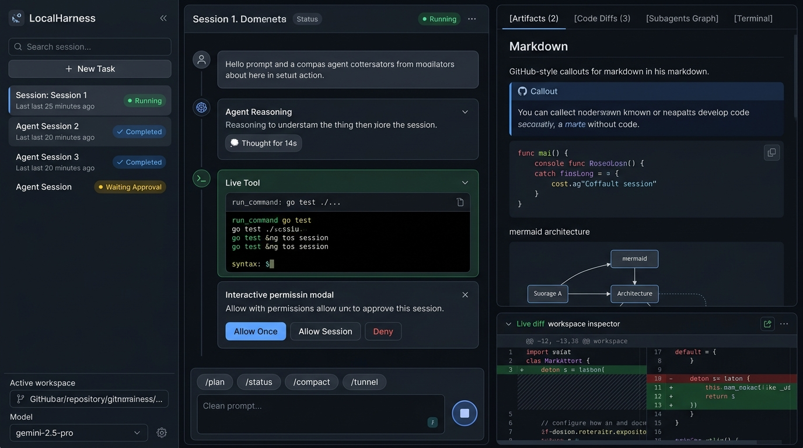

# Proposal & Spec: Modular Agent-Driven React UI (`ui/`) with `pnpm`

**Status**: Proposed / In Review  
**Priority**: High  
**Target Milestone**: `v0.4.0`  
**Deployment Targets**: Web Remote Control (`/remote-control` & `--tunnel`) and Local Desktop GUI (`desktop/` via Tauri)  
**Related Docs**: [docs/remote-control.md](../remote-control.md), [ROADMAP.md](../../ROADMAP.md)

---

## 1. Problem Statement & Motivation

Currently, LocalHarness ships an embedded monolithic HTML file (`internal/server/web/remote_control.html`, ~52 KB, 1,600+ lines of vanilla JS and inline CSS) to power web remote access via Cloudflare Quick Tunnels (`/remote-control` / `lhctl --tunnel`).

While this single-file prototype proved effective for basic mobile monitoring, it faces severe architectural and UX bottlenecks:
1. **No Component Modularity**: All state, styling, DOM mutations, and WebSocket transport are tightly coupled in one HTML file, making it brittle and difficult to maintain.
2. **Missing Rich Inspector Capabilities**: There is no dedicated surface to inspect **generated artifacts** (rendered Markdown with Mermaid diagrams, HTML previews, images), **unified code diffs**, **live subagent DAG execution trees**, or **interactive background terminals**.
3. **No Code Reuse for Desktop GUI**: LocalHarness has an upcoming roadmap item for a standalone local Desktop GUI application (packaged via Tauri/webview). Maintaining two separate frontend codebases (one for remote web and one for desktop) is redundant and error-prone.

### Solution

Create a first-class **`ui/`** directory in the repository containing a modern, high-performance, modular **React + TypeScript** Single-Page Application (SPA) managed by **`pnpm`**.

This frontend will be built once and served across two environments:
1. **Web Remote Control**: Built to static assets (`ui/dist/`), embedded into the Go daemon binary via `//go:embed`, and served over local HTTP or Cloudflare Quick Tunnels.
2. **Local Desktop GUI**: Packaged seamlessly into a native desktop shell (via Tauri v2) connecting to the LocalHarness daemon with local IPC / WebSocket bindings.

---

## 2. Design Paradigm: Agent-Driven UI

> [!IMPORTANT]
> **This is an Agent-Driven UI, NOT a traditional code editor or VS Code IDE clone.**
>
> In tools like Google Antigravity UI or Devin, the autonomous agent is the primary driver of workspace changes. The UI's purpose is to give the user visibility into the agent's thought process, real-time tool executions, and generated outputs, while offering effortless human-in-the-loop interventions (approvals, guidance, and questions).

```
+-------------------------------------------------------------------------------------------------------+
| LocalHarness Agent UI                                                            (o) Connected [v0.4] |
+----------------------+-----------------------------------------------+--------------------------------+
|  LEFT PANE           |  MIDDLE PANE (Chat & Execution Timeline)      |  RIGHT PANE (Live Inspector)   |
|  (Sessions & Context)|                                               |  (Artifacts, Diffs, DAG, Term) |
|                      |  [Session 1: Feature Implementation]  Running |                                |
|  [Search...]         |                                               |  [Artifacts (2)] [Diffs] [DAG] |
|  [+ New Session]     |  [User Prompt]                                |                                |
|                      |  "Add web search tool and verify tests..."    |  # Architectural Specification |
|  Active Sessions:    |                                               |  > [!NOTE] System Design       |
|  * Session 1 (Run)   |  [Agent Reasoning: 💭 Thought for 14s]        |  ```mermaid                    |
|  * Session 2 (Done)  |  "Analyzing test suite and coverage..."       |  graph LR; A-->B;              |
|  * Session 3 (Wait)  |                                               |  ```                           |
|                      |  [Tool: run_command "go test ./..."] (Folded) |                                |
|  Active Workspace:   |                                               |  +----------------------------+|
|  /path/to/project    |  [Interactive Approval Card]                  |  | Live Diff: engine.go       ||
|  (main branch)       |  "Allow tool execution outside workspace?"    |  | - oldCode                  ||
|                      |  [Allow Once] [Allow Session] [Deny]          |  | + newCode                  ||
|  Model:              +-----------------------------------------------+  +----------------------------+|
|  [gemini-2.5-pro v]  |  [/plan] [/status] [/compact] [/tunnel]       |  Terminal Output / HUD        |
|  [Settings] [Tunnel] |  [Message LocalHarness agent...]      [Stop]  |  $ go test -v ./... -> PASS    |
+----------------------+-----------------------------------------------+--------------------------------+
```

---

## 3. UI Layout Specification: The 3-Pane Architecture



### Pane 1: Left Pane — Sessions, Workspaces & System Controls (Width: 260px – 320px)

The control center for organizing conversations, switching contexts, and monitoring daemon connectivity:
- **Header**: LocalHarness brand mark, daemon version badge (`v0.4.0`), connection status indicator (Connected / Reconnecting / Offline).
- **Session Search & Filter**: Real-time fuzzy search (`Cmd/Ctrl+K`) across session titles, user prompts, and workspace paths.
- **`+ New Session` Button**: Triggers session launcher modal with workspace path picker, model override, and initial prompt template.
- **Session List**:
  - Cards indicating session title, relative timestamp ("2m ago"), and state badge:
    - 🟢 `RUNNING` (pulsing indicator)
    - 🟡 `WAITING_APPROVAL` (permission or `ask_question` pending)
    - 🔵 `COMPLETED`
    - 🔴 `ERROR` / `STOPPED`
  - Active session highlight with quick actions (Rename, Duplicate, Export Transcript JSONL, Archive/Delete).
- **Workspace Context Widget**:
  - Active directory path, git repository name, current branch (`git rev-parse --abbrev-ref HEAD`), and uncommitted changes count.
- **System Controls (Footer)**:
  - **Model Selector**: Dropdown to switch model family (`gemini-2.5-pro`, `gpt-4o`, `claude-3-5-sonnet`, `deepseek-r1`, `ollama/...`).
  - **Cloudflare Tunnel Toggle**: One-click start/stop for Quick Tunnels with modal showing the live URL and scannable ANSI/SVG QR code.
  - **Settings Gear**: Drawer/modal for workspace trust policies, API keys, auto-run toggles, and domain allowlists.

---

### Pane 2: Middle Pane — Conversation Stream, Agent Reasoning & Tools (Flexible Width)

The primary interaction canvas where the user collaborates with the agent:
- **Session Sticky Header**:
  - Conversation Title (auto-synthesized by agent).
  - Live execution timer (e.g. `01:24s`), cumulative token metrics (input / output / context window usage bar).
  - Stop / Interrupt button (`Esc`), Detach session button.
- **Conversation Timeline (Scrollable Viewport)**:
  - **User Message Bubbles**: Clean card presentation with prompt text, attached files/images, and timestamp.
  - **Collapsible Agent Reasoning Block (`<ThoughtBlock />`)**:
    - Displays reasoning tokens in real time with an animated pulse and timer (`💭 Thought for 14s`).
    - Collapses into a subtle pill when thinking finishes; expandable with a single click to inspect full chain-of-thought.
  - **Streaming Agent Response**: Markdown rendering using GitHub Flavored Markdown (GFM), syntax-highlighted code blocks with "Copy" and "Apply" buttons.
  - **Collapsible Tool Execution Cards (`<ToolExecutionCard />`)**:
    - Displays tool name (e.g. `run_command`, `replace_file_content`, `read_url_content`, `web_search`).
    - Tool state: `Running` (spinner), `Success` (green check), `Failed` (red alert).
    - Header shows command line or target file path with duration (`120ms`).
    - Expandable body reveals input JSON parameters, stdout/stderr stream, or file diff previews with terminal syntax highlighting.
  - **Interactive Human-in-the-Loop Interventions**:
    - **Permission Approval Cards**: Prompts for risky operations (`run_command`, destructive edits, external network access) with `Allow Once`, `Allow in Session`, `Always Allow`, and `Deny` buttons.
    - **`ask_question` Cards**: Renders interactive multiple-choice buttons, checkboxes for multi-select, and a write-in input field with a direct "Submit Answer" button.
    - **Domain Allowlist Approval Modals**: Prompts to approve external URLs with domain scoping.
- **Docked Prompt Input Bar (Bottom)**:
  - **Slash Command Autocomplete Bar**: Quick chips for `/plan`, `/btw`, `/status`, `/compact`, `/tunnel`, `/remote-control`, `/help`.
  - **Multi-Line Auto-Growing Textarea**: Handles `Shift+Enter` for new lines, `Enter` to submit.
  - **Toolbar Elements**:
    - File & Image attachment upload button (with drag-and-drop support anywhere on the middle pane).
    - YOLO / Auto-Approve toggle switch (for hands-off autonomous execution).
    - Dynamic Action Button: Send icon when idle, solid Square Stop icon when running.

---

### Pane 3: Right Pane — Artifacts, Code Diffs & Workspace Inspector (Width: 380px – 550px)

The inspection and proof workspace that updates live as the agent performs actions:
- **Tabbed Inspector Header**:
  - `[Artifacts (N)]`
  - `[Code Diffs (M)]`
  - `[Subagents Graph]`
  - `[Terminal Console]`
  - `[Browser / Desktop HUD]` (conditional)
- **Tab 1: Live Artifact Viewer (`<ArtifactViewer />`)**:
  - Dedicated viewer for markdown artifacts generated in `<appDataDir>/brain/<session-id>/`.
  - Full GFM support: Tables, GitHub-style callouts (`[!NOTE]`, `[!TIP]`, `[!WARNING]`, `[!CAUTION]`), task lists, Mermaid diagram rendering.
  - Live HTML / SVG rendering sandbox (for web prototypes generated by the agent).
  - Image gallery with full-resolution zoom.
  - Action buttons: "Copy Raw Markdown", "Download", "Open in Editor".
- **Tab 2: Code Changes & Diffs (`<DiffViewer />`)**:
  - Real-time aggregation of all files touched in the current turn or session.
  - Unified and Side-by-Side (Split) diff view with syntax highlighting and line numbers.
  - Per-file navigation list with changed line stats (`+14 -3`).
- **Tab 3: Subagent Execution DAG Tree (`<SubagentsTree />`)**:
  - Visual hierarchy graph of parent agents and spawned subagents (`research`, `self`, `browser_subagent`).
  - Real-time status for each subagent (Running, Idle, Waiting for Dependents).
  - Deep-link click to view subagent transcript or switch focus.
- **Tab 4: Background Tasks & Terminal (`<TerminalConsole />`)**:
  - Live interactive or streaming terminal viewer powered by `@xterm/xterm`.
  - Streams stdout/stderr from long-running background commands or dev servers launched by the agent.
- **Tab 5: Browser & Desktop HUD (`<AgentHUD />`)**:
  - Mirrored live viewport stream when Playwright browser or desktop subagent tools capture screenshots.

---

## 4. Mobile & Responsive Adaptations (Remote Control Mode)

When accessed from a mobile browser or tablet via Cloudflare Quick Tunnel:
- The 3 panes collapse into a seamless **bottom tab navigation bar**:
  - **Tab 1: Chat** (Middle pane — primary mobile focus with full touch optimization).
  - **Tab 2: Artifacts** (Right pane viewer with touch swipe gestures).
  - **Tab 3: Sessions** (Slide-over drawer from the left).
- Floating Action Button (FAB) or sticky banner for pending approvals so user can approve tools in one tap from mobile.

---

## 5. Technical Stack & Implementation Architecture

### Frontend Technology Stack

| Layer | Technology | Rationale |
|:---|:---|:---|
| **Directory** | `ui/` | Clean separation at root of repository |
| **Package Manager** | `pnpm` (v9+) | Fast, strict dependency resolution, workspace friendly |
| **Framework & Build** | **React 19 + TypeScript + Vite** | Instant HMR, lightweight bundles, zero config SSR overhead |
| **Styling & Theme** | **Tailwind CSS + shadcn/ui** | Accessible Radix UI primitives with Tailwind dark theme (`#0b0f17`) |
| **UI Components** | **shadcn/ui (Radix Primitives)** | Standardized dialogs, dropdowns, tabs, popovers, tooltips |
| **Icons** | **Lucide React** | Consistent, modern developer tool icon set |
| **Markdown & Diagrams**| `react-markdown` + `remark-gfm` + `mermaid` | Renders rich GitHub callouts, code blocks, and diagrams |
| **Code & Diffs** | **`@git-diff-view/react`** (Lightweight) | Fast, zero-Monaco bloat, unified & split diffs with syntax highlighting |
| **Terminal Emulator** | `@xterm/xterm` + addons | ANSI color codes, streaming stdout/stderr terminal view |
| **State Management** | **Zustand** | Minimal boilerplate, handles high-frequency WebSocket streams |
| **Client Transport** | Custom WebSocket Store (`/api/ws`) | Reconnect logic, heartbeat, JSON message parsing |

---

### Directory Layout (`ui/`)

```text
ui/
├── index.html
├── package.json
├── pnpm-lock.yaml
├── tsconfig.json
├── tsconfig.node.json
├── vite.config.ts
├── tailwind.config.js
├── postcss.config.js
├── public/
│   ├── favicon.svg
│   └── logo.svg
└── src/
    ├── main.tsx
    ├── App.tsx
    ├── index.css
    ├── types/
    │   ├── protocol.ts        # Typed mirrors of Protobuf / JSON server messages
    │   ├── session.ts         # Session, turn, and token types
    │   ├── tools.ts           # Tool call schemas and execution states
    │   └── artifacts.ts       # Artifact metadata and content models
    ├── stores/
    │   ├── websocketStore.ts  # WS connection, message router, reconnect loop
    │   ├── sessionStore.ts    # Active sessions, history, selection
    │   ├── chatStore.ts       # Messages, streaming tokens, thinking blocks
    │   └── uiStore.ts         # Active tabs, pane resizing, modal states
    ├── hooks/
    │   ├── useWebSocket.ts
    │   ├── useAutoScroll.ts
    │   └── useKeyboardShortcuts.ts
    ├── components/
    │   ├── common/            # Buttons, Badges, Modals, Dropdowns
    │   ├── layout/
    │   │   ├── ThreePaneLayout.tsx
    │   │   ├── Header.tsx
    │   │   └── ResizableSplitter.tsx
    │   ├── left-pane/
    │   │   ├── SessionList.tsx
    │   │   ├── SessionSearch.tsx
    │   │   ├── WorkspaceWidget.tsx
    │   │   └── TunnelModal.tsx
    │   ├── middle-pane/
    │   │   ├── ChatTimeline.tsx
    │   │   ├── MessageBubble.tsx
    │   │   ├── ThoughtBlock.tsx
    │   │   ├── ToolExecutionCard.tsx
    │   │   ├── ApprovalModal.tsx
    │   │   ├── AskQuestionCard.tsx
    │   │   └── PromptInputDock.tsx
    │   └── right-pane/
    │       ├── InspectorTabs.tsx
    │       ├── ArtifactViewer.tsx
    │       ├── DiffViewer.tsx
    │       ├── SubagentsTree.tsx
    │       └── TerminalConsole.tsx
    └── utils/
        ├── formatters.ts      # Token counts, timestamps, duration
        └── ansi.ts            # Terminal escape sequence helpers
```

---

## 6. Backend Integration & Go Embedding

### Static Asset Embedding

During build, Vite outputs to `ui/dist/`. The Go backend embeds these assets into `internal/server/web/ui.go`:

```go
package web

import (
	"embed"
	"io/fs"
	"net/http"
)

//go:embed all:dist
var uiDistFS embed.FS

// DistHandler returns an http.Handler serving the embedded React SPA.
func DistHandler() http.Handler {
	sub, err := fs.Sub(uiDistFS, "dist")
	if err != nil {
		panic(err)
	}
	return http.FileServer(http.FS(sub))
}
```

### Dev vs Production Workflow
- **Development**: Run `pnpm dev` inside `ui/`. Vite runs on `http://localhost:5173` with a proxy forwarding `/api` and WebSocket connections to the running LocalHarness daemon on `localhost:8080`.
- **Production Build**: `pnpm build` creates static HTML/JS/CSS assets in `ui/dist/`. `make build` packages them directly into the standalone `localharness` binary.

### Build Tooling in `Makefile`

```makefile
# UI targets
.PHONY: ui-deps ui-build ui-dev

ui-deps:
	@cd ui && pnpm install

ui-build: ui-deps
	@echo "==> Building React UI..."
	@cd ui && pnpm build
	@echo "==> React UI build complete in ui/dist"

ui-dev:
	@cd ui && pnpm dev
```

---

## 7. Migration & Local Desktop GUI Roadmap (Tauri v2)

1. **Step 1 (Immediate)**: Build the React SPA in `ui/`, replacing the monolithic `remote_control.html` for web remote control.
2. **Step 2 (Parity & Verification)**: Ensure 100% feature parity with current remote-control capabilities:
   - Real-time token streaming & reasoning blocks.
   - Interactive `ask_question` cards & tool approval modals.
   - Session switcher & multi-session search.
   - Cloudflare Quick Tunnel stop/status controls.
3. **Step 3 (Desktop GUI)**: Wrap `ui/` inside a `desktop/` directory using Tauri v2:
   - `desktop/src-tauri` invokes `localharness daemon` in the background.
   - Connects to the local daemon via localhost WebSocket or Tauri IPC commands.
   - Adds native menu bar tray, OS notification badges, and native file dialogs.

---

## 8. Phased Implementation Plan

- [ ] **Phase 1: Project Setup & Build Harness**
  - [ ] Initialize `ui/` with `pnpm init`, Vite, React 19, TypeScript, and Tailwind CSS.
  - [ ] Add Makefile targets (`ui-deps`, `ui-build`, `ui-dev`) and configure Vite proxy to LocalHarness daemon.
  - [ ] Configure `internal/server/` Go embed for `ui/dist` with SPA fallback routing.

- [ ] **Phase 2: Core Design System & 3-Pane Shell**
  - [ ] Implement responsive 3-Pane layout with draggable splitters.
  - [ ] Configure dark slate developer palette matching mockups.
  - [ ] Build mobile navigation drawer & responsive collapse behavior.

- [ ] **Phase 3: WebSocket Transport & Store Layer**
  - [ ] Implement typed WebSocket client in `websocketStore.ts` with auto-reconnect and heartbeat.
  - [ ] Wire `/api/sessions` REST endpoints and session switcher state in `sessionStore.ts`.

- [ ] **Phase 4: Middle Pane (Chat & Interactive Interventions)**
  - [ ] Build `<ChatTimeline />` with auto-scroll and scroll-to-bottom FAB.
  - [ ] Build collapsible `<ThoughtBlock />` with live timer for reasoning tokens.
  - [ ] Build `<ToolExecutionCard />` with status badges, stdout logs, and duration timers.
  - [ ] Build interactive `<ApprovalModal />` and `<AskQuestionCard />` with write-in options.
  - [ ] Build `<PromptInputDock />` with slash command pills (`/plan`, `/status`, `/tunnel`).

- [ ] **Phase 5: Right Pane (Artifacts, Diffs & Terminal)**
  - [ ] Implement `<ArtifactViewer />` with GFM markdown, callouts, and Mermaid diagrams.
  - [ ] Implement `<DiffViewer />` for multi-file red/green diff inspection.
  - [ ] Implement `<TerminalConsole />` with xterm.js for streaming background tasks.
  - [ ] Implement `<SubagentsTree />` visualizer.

- [ ] **Phase 6: Remote-Control Cutover & Deprecation**
  - [ ] Replace `internal/server/web/remote_control.html` with the embedded React build.
  - [ ] Validate Cloudflare Quick Tunnel end-to-end access from mobile and tablet browsers.
  - [ ] Update `docs/remote-control.md` and user guides.

- [ ] **Phase 7: Desktop Application Integration**
  - [ ] Initialize Tauri v2 project pointing to `ui/dist`.
  - [ ] Package cross-platform desktop bundles (macOS `.dmg`, Linux `.AppImage`, Windows `.msi`).
